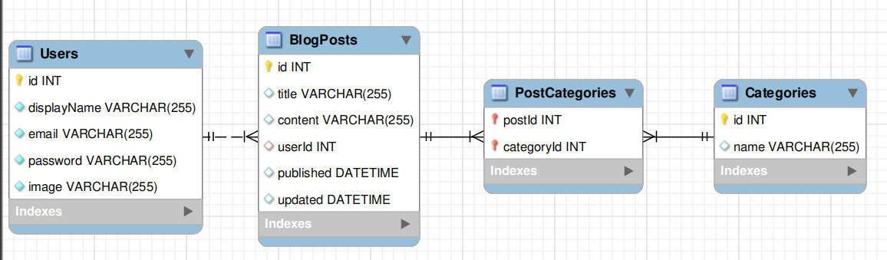

<h1 align="center">Projeto Blogs Api</h1>
<p align="center">Neste projeto, foram desenvolvidos uma API e um banco de dados para a produção de conteúdo para um blog.</p>

---


<br>

<h3 align="center">Diagrama DER (Diagrama de Entidade-Relacionamento)</h3>



---

<br>

<h2 align="center">📃 Sobre o Projeto</h2>

<p align="center">Foi desenvolvida uma aplicação em Node.js usando o pacote sequelize para fazer um CRUD de posts. Os endpoints foram ligados ao banco de dados seguindo os princípios do REST.
  Para criar posts, o usuario deve estar cadastrado e logad sendo validado por um token gerado atravez do JWT(json web token).
</p>

<br>

<h2 align="center">Rotas utilizáveis</h2>

<details>
  <summary><strong>Ver rotas</strong></summary><br />
  
  - POST `/user` para cadastrar novo usuario. Utilize um body nesse formato:

```jsx
{
  "displayName": "Monkey D. Luffy",
  "email": "luffy@pirateking.com",
  "password": "estoucomfome",
  "image": "https://img.assinaja.com/upl/lojas/mundosinfinitos/imagens/foto-one-piece.png"
}
```
  
---
  
- POST `/login` para fazer login e receber um token. Utilize um body nesse formato:

```jsx
{
  "email": "luffy@pirateking.com",
  "password": "estoucomfome"
}
```
  
---
  
- POST `/post` para criar uma nova postagem. Utilize um body nesse formato:

```jsx
{
  "title": "Serei o rei dos piratas",
  "content": "Vou encontrar todos os pegaços",
  "categoryIds": [1]
}
```

---
  
- POST `/categories` para adicionar uma nova categoria. Utilize um body nesse formato:

```jsx
{
  "name": "Animation"
}
```

---

- GET `/user` traz todos os usuarios.

---

- GET `/user/:id` traz o usuário de acordo com o id no banco de dados se ele existir.

---

- GET `/categories` para buscar todas as categorias.

---
  
- GET `/post` para trazer todos os blogs post.
  
---
  
- GET `/post/:id` para trazer o blog post baseado no id do banco de dados se ele existir.
  
---
  
- GET `/post/search?q=<conteudo da busca>` retornar um array de post que contenham em seu título ou conteúdo o termo passado na URL. Exemplo de url:

```jsx
  http://localhost:<PORT>/post/search?q=comida
```

---

- PUT `/post/:id` para atualizar o poste caso ele exista e pertença ao usuario logado. Utilize um body nesse formato:

```jsx
{
  "title": "Lufeeeee",
  "content": "Cade minha comida"
}
```

---

- PUT `/sales/:id` para atualizar a venda. Utilize um body nesse formato:

```jsx
  [
    {
      "productId": 1,
      "quantity":2
    },
  ]
```

---
  
- DELETE `/post/:id` deleta um blog post de acordo com o id caso a pessoa seja dona dele.
  
---
  
- DELETE `/user/me` encontra o usuario logado travez do token de validação e o deleta.

</details>

<br>

---

### 🛠 Tecnologias e Bibliotecas utilizadas no desenvolvimento do projeto

- **[Node.js](https://nodejs.org/en/)**

- **[MySQL](https://www.mysql.com/products/workbench/)**

- **[Mysql2](https://www.npmjs.com/package/mysql2)**

- **[Express](http://expressjs.com/pt-br/)**

- **[Nodemon](https://www.npmjs.com/package/nodemon)**
  
- **[Sequelize](https://sequelize.org/)**
  
- **[JWT](https://jwt.io/introduction)**
  
- **[Joi](https://www.npmjs.com/package/joi)**


---

### 🚀 Como executar o projeto

_Pré-requisitos_

Antes de começar, você vai precisar ter instalado em sua máquina as seguintes ferramentas:
- [Git](https://git-scm.com)
- [Node.js](https://nodejs.org/en/)
- [Mysql](https://www.mysql.com/) para rodar local ou [Docker](https://docs.docker.com/get-docker/) para rodar em container.

É recomendado utilizar algum cliente HTTP, como [Postman](https://www.postman.com/) ou o [Insomnia](https://insomnia.rest/download).

Também é bom ter um editor para trabalhar com o código como [VSCode](https://code.visualstudio.com/)

---

_1- Clonar o repositorio_

```jsx
git clone git@github.com:TonyyCruz/blogs_api.git
```

---


<details>
  <summary><strong>:whale: Rodando no Docker</strong></summary><br />
  
  ## Com Docker
 
 
_Rode o serviço `node` com o comando_

```jsx
  docker-compose up -d
```

- Esse serviço irá inicializar dois containers chamados `blogs_api` e outro chamado `blogs_api_db`.
  - A partir daqui você pode rodar o container via CLI ou abri-lo no VS Code.

_Via CLI use o comando_
```jsx
docker exec -it blogs_api bash
```
- Ele te dará acesso ao terminal interativo do container blogs_api(node) criado pelo compose, que está rodando em segundo plano.

_Instale as dependências `dentro do container` com_

```jsx
npm install
```

⚠️Atenção: Caso opte por utilizar o Docker, TODOS os scripts disponíveis no package.json devem ser executados DENTRO do container, ou seja, no terminal que aparece após a execução do comando docker exec.
  
  </details>
  
---
  
<details>
  <summary><strong>:computer: Rodando Localmente</strong></summary><br />
 
 _Instale as dependências com o comando_
 
 ```jsx
npm install
```
- Para rodar o projeto desta forma, **obrigatoriamente** você deve ter o `node` instalado em seu computador.
  - Recomenda-se a versão `^16`
  
 ⚠️Atenção: Não esqueça de renomear/configurar o arquivo .env.example
</details>

---


### 💡 Scripts prontos
<details>
  <summary><strong>Scripts</strong></summary><br />

  - Criar o banco de dados e gerar as tabelas:
  ```sh
    npm run prestart
  ```

  - Limpar e popular o banco de dados:
  ```sh
    npm run seed
  ```

  - Iniciar o servidor Node:
  ```sh
    npm start
  ```

  - Iniciar o servidor Node com nodemon:
  ```sh
    npm run debug
  ```

  <br />
</details>

---
